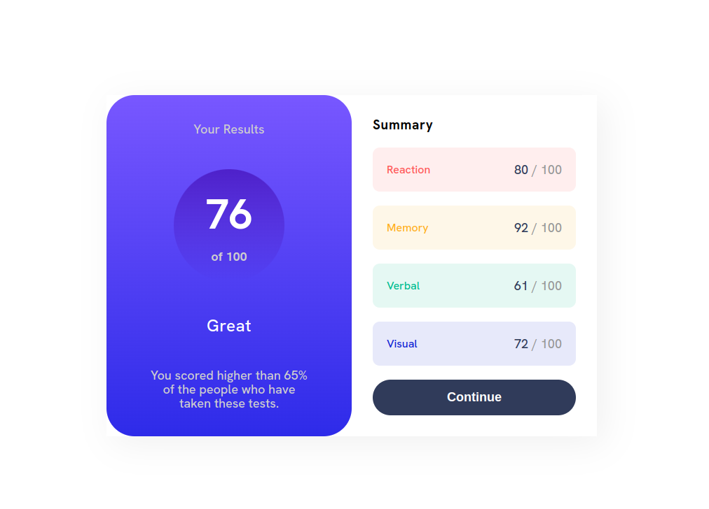

# Frontend Mentor - Results summary component solution

This is a solution to the [Results summary component challenge on Frontend Mentor](https://www.frontendmentor.io/challenges/results-summary-component-CE_K6s0maV). Frontend Mentor challenges help you improve your coding skills by building realistic projects.

## Table of contents

-   [Overview](#overview)
    -   [The challenge](#the-challenge)
    -   [Screenshot](#screenshot)
    -   [Links](#links)
-   [My process](#my-process)
    -   [Built with](#built-with)
    -   [Continued development](#continued-development)
-   [Author](#author)

## Overview

### The challenge

This challenge has something for everyone. It’s a HTML and CSS only project, but we’ve also provided a JSON file of the test results for anyone wanting to practice JS.

### Screenshot

### Links

-   Solution URL: [Click!](https://github.com/kzborisov/results-summary-component)
-   Live Site URL: [Click!](https://main.d2w6b36s2b79wv.amplifyapp.com/)

## My process

### Built with

-   [React](https://reactjs.org/) - JS library

## Author

-   Frontend Mentor - [@kzborisov](https://www.frontendmentor.io/profile/kzborisov)
